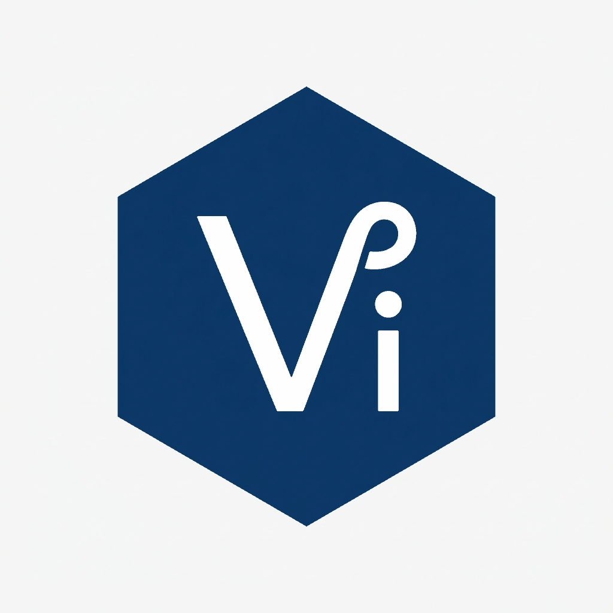

<div align="center">



# Viss Programming Language
### The High-Performance, Visually Structured Language for Everyday Development & Systems

[](https://github.com/Halva-developer/Viss)
[](LICENSE)
[](https://github.com/Halva-developer/Viss)
[](https://github.com/Halva-developer/Viss)

</div>

---

## 🌟 What is Viss?

**Viss** is a modern general-purpose programming language designed to unite the **extreme speed and standalone deployment of C++** with the **ergonomics, joy, and rapid development of Python**.

Unlike traditional C-family languages, Viss introduces an iconic **Prefix Design System** (`!`, `?`, `@`, `$`) combined with strict architectural structure and clean pipeline typings (`| type`). In Viss, code is readable at a glance: actions, logical conditions, identifiers, and compiler directives are immediately distinguishable without mental fatigue.

### Core Philosophy
* **Pure Native Speed:** Compiles directly into zero-overhead native machine code (C++17 backend). No heavy interpreter, no virtual machine warmup, no GIL.
* **Single Binary Deployment:** Produces lightweight standalone executables (1–2 MB). No runtime installations or environment configurations required for end users.
* **Zero Boilerplate, Strict Structure:** Eliminates unstructured script chaos by enforcing clear entry points (`!func main()`) and structured entity definitions.
* **Batteries Included via C/C++ Ecosystem:** Out-of-the-box support for modern graphics, 2D/3D audio, networking, system shell scripting, and instant interop with millions of existing C/C++ libraries.

---

## 💎 The Golden Prefix Architecture

Every token in Viss clearly defines its semantic intent via prefixes:

| Prefix | Semantic Role | Examples |
| :---: | :--- | :--- |
| **`!`** | **Flow & Action** | `!func`, `!async.func`, `!class`, `!struct`, `!for`, `!break;`, `!continue;` |
| **`?`** | **Logic & Error Boundaries** | `?if`, `?else`, `?match`, `?try`, `?expect`, `?error`, `??` |
| **`@`** | **State & Data Identifiers** | `@player`, `@score`, `@inventory`, `@me` *(instance context)* |
| **`$`** | **Compiler & Environment Directives** | `$import lib "..." as ...`, `$import cpp <...> as ...`, `$kernel` |

---

## 🚀 Syntax at a Glance

### 1. Variables & Pipeline Typing
Variables are declared and assigned dynamically with explicit type hinting via the pipe (`|`) operator:
```viss
@name = "Halva" | str;
@score = 100 | int;
@speed = 12.5 | dec;
@active = true | bool;

// Dynamic heterogeneous list (stores any types without crashes!)
@inventory = ["Sword", 42, true] | list;

// Constants with comma modifier (cannot be reassigned)
@MAX_HEALTH = 100 | int, const;
@MAX_HEALTH del; // Explicit memory cleanup when needed

// Type conversion pipeline
@user_input = "25" | str;
@age = @user_input | int; // Converted to integer instantly!
```

### 2. String Interpolation (`i"..."`)
Strings prefixed with `i` support direct in-place variable embedding without cumbersome concatenation or forced brackets:
```viss
io.println(i"Welcome @player.name! Current score: @player.score");

// Complex expressions use curly brackets:
io.println(i"Next level in: {@needed_score - @player.score} points");
```

### 3. Object-Oriented Programming & Classes
Classes are defined with `!class`. The constructor is declared as `!func main(...)`, and the instance is referenced via `@me`:
```viss
!class Player :: Entity { // Inheritance via '::'
    !func main(name as str, score as int) {
        @me.name = name | str;
        @me.score = score | int;
        @me.items = [] | list;
    }

    !func add_item(item as str) {
        @me.items.append(item);
    }
}

// Instantiating with explicit entity classifier:
@hero = Player("Arthur", 100) | class;
@hero.add_item("Excalibur");
```

### 4. Dynamic Variable Bags (`| inf`)
For dynamic systems (game state, AI agents, server entity-component systems), Viss introduces **Infinite Dynamic Tables (`inf`)**:
```viss
!class StateStore {
    !func main() {
        @me.vars = {"health": 100} | inf;
    }

    !func set(key as str, val as any) {
        @me.vars[key] = val; // Add or mutate properties on the fly!
    }
}

@store = StateStore() | class;
@store.set("buff_strength", 25);
io.println(i"Buff: {@store.vars["buff_strength"]}");
```

### 5. Control Flow, Loops & Ranges
Viss provides range iterators and collection traversals:
```viss
// Number range iteration (0 to 10)
!for @i in 0..10 {
    io.println(i"Iteration: @i");
}

// Collection iteration
!for item in @hero.items {
    io.println(i"Carrying: @item");
}
```

### 6. Pattern Matching (`?match`)
Pattern matching provides clean, expressive multi-way branching with automatic fallthrough prevention:
```viss
!func get_rank(score as int) to str {
    ?match score {
        case 100 {
            return "Champion";
        }
        case 50 {
            return "Warrior";
        }
        else {
            return "Recruit";
        }
    }
}
```

### 7. Asynchronous Flow & Concurrency
Asynchronous functions run on an optimized thread pool and are awaited with clean `await`:
```viss
!async.func fetch_bonus(player_name as str) to int {
    await async.sleep(100); // Non-blocking background sleep
    return 25;
}

// Inside an async function:
@bonus = await fetch_bonus(@player.name);
@player.score += @bonus;
```

### 8. Error Handling & Predicates
Predictive functions returning booleans end with `?()` (e.g. `is_active?()`). Errors are handled via `?try` and `?expect`, or triggered with `?error`:
```viss
!func verify_health(hp as int) {
    ?if (hp <= 0) {
        ?error "Player is defeated!";
    }
}

?try {
    verify_health(@player.hp);
}
?expect Exception as @e {
    io.println(i"Error intercepted: @e");
}
```

### 9. Resource Safety with `defer`
Ensure files, sockets, and memory handles close reliably upon scope exit:
```viss
@file = sys.file.open("config.json", "w");
defer @file.close(); // Guaranteed execution on function exit

@file.write("{\"status\": \"ok\"}");
```

---

## 📄 Canonical Code Reference (`preview.viss`)

The full feature set of Viss v0.0.1.2 is demonstrated in `preview.viss`:

```viss
$import lib "asyncIO" as async // Import asynchronous runtime
$import lib "iostream" as io  // Import console I/O

!async.func main() { // Main entry point
    ?try {
        // Instantiate class with explicit | class classifier
        @player = Player("Halva", 100) | class;
        @rank = get_rank(@player.score);
        io.println(i"Player: @player.name, Rank: @rank");

        // Async task execution
        @bonus = await load_bonus_points(@player.name);
        @player.score += @bonus;
        io.println(i"New score: @player.score");

        // Collections & iteration
        @inventory = ["Sword", "Shield", "Elixir"] | list;
        !for item in @inventory {
            @player.add_item(item);
        }
        io.println(i"Inventory count: {@player.items.len}, Last: {@player.items.last}");
    }
    ?expect Exception as @e {
        io.println(i"Critical error: @e");
    }
}

!class Player {
    !func main(name as str, score as int) {
        @me.name = name | str;
        @me.score = score | int;
        @me.items = [] | list;
    }

    !func add_item(item as str) {
        @me.items.append(item);
    }
}

!func get_rank(score as int) to str {
    ?match score {
        case 100 {
            return "Champion";
        }
        case 50 {
            return "Warrior";
        }
        else {
            return "Recruit";
        }
    }
}

!async.func load_bonus_points(name as str) to int {
    await async.sleep(100);
    return 25;
}
```

---

## 🛠️ CLI Usage & Toolchain

The Viss toolchain provides compilation, validation, and direct execution out of the box:

```bash
# Transpile and build native binary:
viss preview.viss

# Build and immediately execute:
viss preview.viss -r

# Or run directly via Python bootstrap:
python viss.py preview.viss -r
```

---

## 📦 Standard Library Modules (`libs/std`)

* `iostream` (`io`): Formatted variadic console I/O, colors, cursor management.
* `asyncIO` (`async`): High-performance thread pool, timers, async task dispatching.
* `system` (`sys`): File system access, process execution (`sys.bash`, `sys.cmd`), platform detection.
* `math`: Trigonometry, rounding, constants (`PI`, `E`).
* `str`: Slicing, trim, upper, lower, split, string formatting.
* `net`: Fast cross-platform TCP/UDP sockets.
* `json`: JSON parsing and serialization.
* `audio`: Zero-dependency cross-platform audio engine (powered by `miniaudio`).
* `raylib`: Hardware-accelerated 2D/3D windowing, shaders, and game input.

---

## 🗺️ Roadmap & Milestones

- [x] Viss 1.0 Initial Prototype & Prefix Specification
- [x] Modular Standard Library Split (`libs/std/`)
- [x] Dynamic String Interpolation (`i"..."`)
- [x] Pipeline Variable Declarations (`| type`, `| const`)
- [x] Class Inheritance (`::`) and Structured Constructor (`!func main`)
- [x] Dynamic Expando Table Storage (`| inf`)
- [x] Pattern Matching (`?match`, `case`, `else`)
- [x] Cross-platform ThreadPool Concurrency (`!async.func`, `await`)
- [ ] Self-contained TCC / Clang embedded JIT compiler for zero-dependency execution
- [ ] Official Visual Studio Code & JetBrains syntax highlighting extension bundle

---

## 📜 License

Viss is released under the terms of the **UniLicense**. You are free to use, modify, distribute, and build commercial software with Viss without restrictions. See [LICENSE](LICENSE) for details.

Developed with 💙 by **Halva-developer** & **Halvik**.
